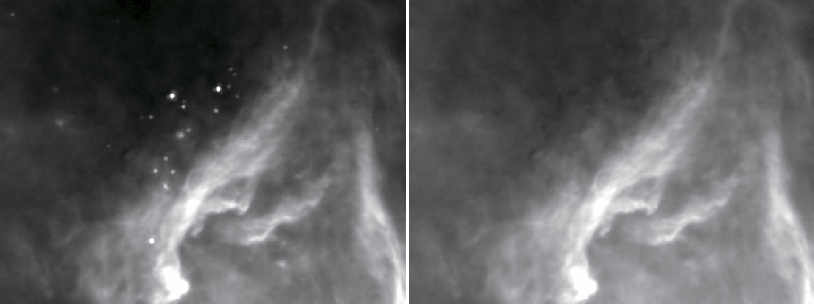
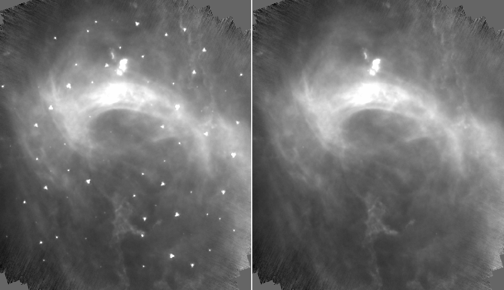
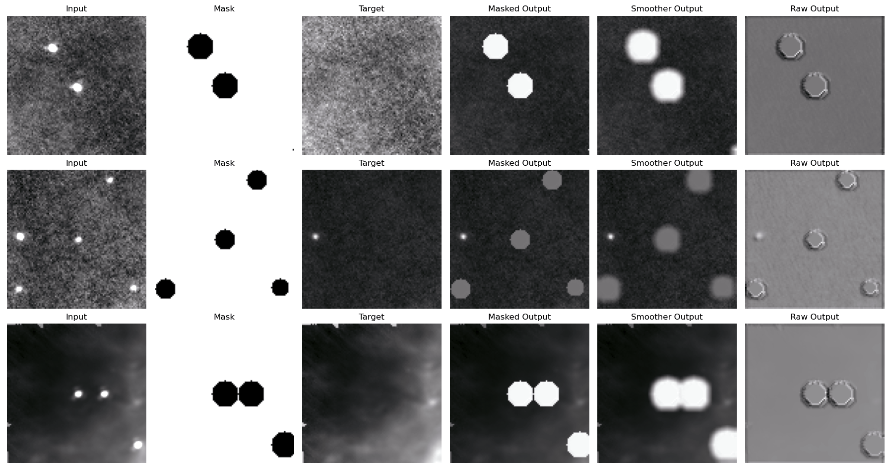
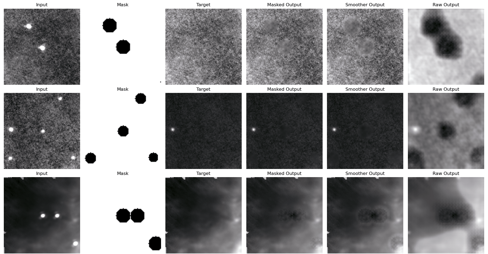

# Compact Source Removal in Herschel Data

This repository contains the official implementation of our paper **"A Deep Neural Network Approach to Compact Source Removal in Herschel Data"**. The code enables the removal of compact sources from Herschel Space Observatory photometric observations, facilitating the analysis of extended emissions and improving the photometry of compact sources.

> **Note:** If you use this repository in your work, please cite our paper. Citation details will be added upon publication.

---

## Table of Contents
1. [Introduction](#introduction)
2. [Environment Setup](#environment-setup)
   - [1.1 Python Environment Setup](#python-environment-setup)
   - [1.2 Data Setup](#data-setup)
3. [Functionality Overview](#functionality-overview)
   - [3.1 Source Removal on Real Data](#source-removal-on-real-data)
   - [3.2 Source Removal on Simulated Data](#source-removal-on-simulated-data)
   - [3.3 Re-training on Custom Data](#re-training-on-custom-data)
4. [How to Cite](#how-to-cite)
5. [License](#license)
---

## Introduction

This project introduces a deep learning-based framework for compact source removal from Herschel photometric maps. It is designed for researchers analyzing extended emissions in the interstellar medium, removing interference caused by point sources. The repository includes:
- Pre-trained models for compact source removal.
- A simulation framework to evaluate model performance.
- A training pipeline for custom datasets.

Follow the steps below to set up the environment and utilize the provided functionality.

---

## Environment Setup

### 1.1 Python Environment Setup

To ensure compatibility and avoid dependency conflicts, we recommend using a conda environment. We provide a `requirements.yml` file for convenience. Follow the instructions below to set up the environment:

1. **Install Conda**: Download and install [Miniconda](https://docs.conda.io/en/latest/miniconda.html) or [Anaconda](https://www.anaconda.com/) if not already installed.
2. **Create Environment**: Use the provided `environment.yml` file to set up the environment.

   **Command:**
   ```bash
   conda env create -f environment.yml
   conda activate csr
   ```

### Note on PyTorch and CUDA
If you intend to use the model on a GPU, it is recommended to first proceed with the default configuration specified in `requirements.yml`, which uses `pytorch-cuda=12.1`. Skip this step and attempt to run the code as-is to verify functionality. If you encounter issues related to GPU usage or PyTorch compatibility, you can revisit this step to troubleshoot and ensure that the PyTorch and CUDA versions align with your system's GPU and driver configuration:
1. Visit [PyTorch's Get Started Guide](https://pytorch.org/get-started/locally/) to check compatibility.
2. Update the PyTorch and CUDA versions in the `requirements.yml` or manually install them after setting up the environment. For example:
   ```bash
   conda install pytorch torchvision torchaudio pytorch-cuda=<your-cuda-version> -c pytorch -c nvidia
   ```

---

### 1.2 Data Setup

To verify that the installation works and to help users understand how to use and later modify the code, we provide example datasets for all three functionalities:
- A few examples for **real source removal** on Herschel data.
- A couple of **simulations** for evaluation.
- A small **toy dataset** for training.

#### Steps to Set Up the Data

1. **Download the Dataset**  
   Download the dataset zip file from [this link](https://drive.google.com/file/d/1OOVHGwEenRHBrYOoaT05Lu5f0wJFiJba/view?usp=sharing).

2. **Extract the Contents**  
   Extract the zip file into the `./data/` directory in the root of the repository. After extraction, the folder structure should look like this:
   ```
   data/
   ├── csv_examples/
   ├── numpy_examples/
   ├── original_examples/
   ├── real_data_examples/
   ├── simulation_examples/
   └── trained_models/
   ```

Each subdirectory contains relevant examples and files to test the functionality. Ensure that the directory structure matches this hierarchy for the code to function correctly.

---

## Functionality Overview

This repository provides three main functionalities, which can be run using two primary scripts:
- **`run_evaluation.py`**: Used for evaluation on simulations and real data.
- **`run_training.py`**: Used for training.

These scripts rely on configuration files to specify parameters and settings. Configuration files are located in the `./config/` folder, with three example files corresponding to the three functionalities:
- **`evaluation_real_data.json`**: For source removal on real data.
- **`evaluation_simulation.json`**: For evaluation on simulated data.
- **`training.json`**: For training on custom datasets.

Each configuration file contains detailed explanations of adjustable parameters. Most users will only need to change a few values, depending on their specific use case.

Additional configuration files are found in `./config/parameters/`, including:
- Aperture photometry settings and correction values for real and simulated PSFs.
- Signal-to-noise ratio (SNR) configurations.

> **Note:** We recommend not modifying `snr_config.json`, as the pre-trained models were built using these parameters, and changes may affect functionality.

---

### 3.1 Source Removal on Real Data

This functionality allows users to remove compact sources from Herschel photometric maps. The code is pre-configured to work seamlessly with the provided example data—no modifications are required to run it. Modifications are only necessary if you intend to use your own data. Below, we explain what changes are needed for custom data.

#### 1. Configuration File
The configuration file for this functionality is `evaluation_real_data.json`, located in `./config/`.  
Key parameters to modify:
- **`observing_parameters`**: Define the observing mode and band.
- **`test_data_dir`**: Specify the input data directory. For the example provided, it is set to `"./data/real_data_examples"`.

#### 2. Input Data
Example data for this functionality is provided in `./data/real_data_examples`.  
This demonstrates the required structure:
- Each input includes:
   1. A **Herschel `.fits` file** (e.g., `1342185553_L2_5.fits`).
   2. A corresponding **`.csv` file** with the same base name (e.g., `1342185553_L2_5.csv`).

- The `.csv` file must include two columns (J2000.0 equatorial coordinates):
   - **`ra`**: Right Ascension.
   - **`dec`**: Declination.

#### 3. Running the Code
To execute the code for this functionality, use:
```bash
python run_evaluation.py --config ./config/evaluation_real_data.json
```

#### 4. Output
The script creates an output directory in `./evaluation_output/{model_name}/{experiment_name}+{date}/`.  
This directory contains:
- **Code backup**: A snapshot of the executed code for reproducibility.
- **Configuration backup**: The exact settings used for the run.
- **Predictions folder**: Includes the input and predicted `.fits` files.
- **Results folder**: Contains a `.csv` file with photometry results for the extracted sources.

Photometry results in the `.csv` file include among many:
- **`Predicted Flux (mJy)`**: Photometry of the extracted sources.
- **`Standard Flux (mJy)`**: Standard aperture photometry results.

#### 5. Verify Output
To confirm that the code executed correctly, open the file `1342185553_L2_5_pred.fits` from the predictions folder using a [FITS viewer](https://sites.google.com/cfa.harvard.edu/saoimageds9). The output should look like the example image below (right side):



If your output resembles the image above, the functionality is working as expected.

---

### 3.2 Source Removal on Simulated Data

This functionality evaluates the model's performance using simulated data with artificially injected sources. The code is pre-configured to run on the provided example data—no modifications are needed to execute it. Modifications are only necessary if you wish to use your own simulated datasets.

#### 1. Configuration File
The configuration file for this functionality is `evaluation_simulation.json`, located in `./config/`.

Key parameters to modify:
- **`test_data_dir`**: Specify the input data directory. For the example provided, it is set to `"./data/simulation_examples"`.
- **`original_data_dir`**: Specify the directory for ground truth targets. For the example, this is set to `"./data/original_examples"`.

#### 2. Input Data
Example data is provided in `./data/simulation_examples`.  
- The structure is identical to real data.
- Ground truth background images are located in `./data/original_examples` (e.g., `1342237154_L2_5.fits`). These represent the expected model output for comparison.

#### 3. Running the Code
To execute the code for simulations, use:
```bash
python run_evaluation.py --config ./config/evaluation_simulation.json
```

#### 4. Output
The output directory structure and contents are the same as for real data.

#### 5. Verify Output
Open the file `1342237154_L2_5_sim0_pred.fits` from the predictions folder using a [FITS viewer](https://sites.google.com/cfa.harvard.edu/saoimageds9). The output should look like the example image below (right side):



If your output resembles the image above, the simulation evaluation worked as expected.

---

### 3.3 Re-training on Custom Data

#### 3.3.1 Training with the Toy Dataset

If you only intend to use this code on Herschel `.fits` images, **there is no need to train a model**, as pre-trained models are included in `./data/trained_models/`. This functionality allows users to retrain the model on custom datasets. The provided toy dataset serves as an example, and no modifications are required to test the example run. Below, we explain the configuration and data structure for customization.

##### 1. Configuration File
The configuration file for training is `training.json`, located in `./config/`. This file explains all parameters.

Key parameters to modify:
- **`data_dir`**: Directory for the image cutouts. Example: `"./data/numpy_examples/"`.
- **`csv_dir`**: Directory for the source indices. Example: `"./data/csv_examples/"`.

These are pre-configured for the toy dataset provided.

##### 2. Input Data
The toy dataset demonstrates how to structure the input data:
- **`numpy_examples`**: Contains folders with `{idx}.npy` files. Each `.npy` file is a 96x96 pixel cutout, as described in the paper.
- **`csv_examples`**: Contains CSV files that map indices to corresponding sources. While these are not needed during training (since all data is in `.npy` files), they serve as a reference for associating indices with sources.

##### 3. Running the Code
To train the model on the provided toy dataset, run:
```bash
python run_training.py --config ./config/training.json
```

##### 4. Output
The script will create an output directory in `./experiments/{model_name}/{experiment_name}+{date}/`.  
This directory contains:
- **Code folder**: Backup of the executed code for reproducibility.
- **Trained model folder**: The best-performing model saved during training.
- **Visualization folder**: Visualizations of the training process, updated after each epoch.
- **Configuration file**: The exact configuration used for the run.

##### 5. Verify Training
To verify that the training process works, even on this toy dataset, you should observe clear improvements from epoch 1 to epoch 20 (images in the visualization folder).

- **After the 1st epoch:**  
  

- **After the 20th epoch:**  
  

If your visualizations resemble these examples, the training process is functioning correctly.

#### 3.3.2 Training on Custom Datasets

This section is for users who wish to implement their own datasets and train a model using our framework. Note that some familiarity with PyTorch is required.

##### Key Steps for Custom Data Training

1. **Dataset Class**
    - The dataset implementation is handled in `code/data/dataset.py`.
    - Our default dataset class is `HerschelNumpyDatasetMultiMasks`, which is tailored for our data structure. Use this as a reference for creating your own dataset class.
    - Your custom dataset class should:
        - Return `input_data`, `target_data`, and `mask_data` tensors in the same format as ours at the end of the `__getitem__` method.
        - Handle data preparation according to your needs.
           - **Recommendation:** Normalize the data consistently with the methodology outlined in the paper, as our experiments showed this provided the best results.
        - **Tip:** Refer to the paper for details on normalization and data preparation.

2. **Configuration File**
    - Once a new dataset class is implemented, update the `dataset_name` parameter in the `training.json` configuration file to the name of your custom dataset class.

3. **Image Size Recommendations**
    - Use image sizes of at least **96x96 pixels**. Larger sizes, such as **128x128** or **256x256**, are also supported without requiring changes to the model architecture.

4. **Other Parameters**
    - Any other parameter modifications depend on your specific use case. All configuration parameters in `training.json` are documented for easy customization.

---

## How to Cite

If you use this repository or find it helpful in your research, please consider citing our paper:

**"A Deep Neural Network Approach to Compact Source Removal in Herschel Data"**

The citation details will be added here after the paper is published.

---

## License

This project is licensed under the [MIT License](./LICENSE). You are free to use, modify, and distribute the code, provided proper attribution is given to the authors. For more details, see the `LICENSE` file in the repository.

---
